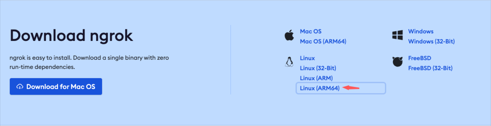
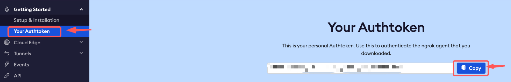

# NGROK
### Description
Herramienta para acceder/exponer desde internet a localhost mediante cualquier puerto.

## Pre-requisites
- Sign in on ngrok.com
- Confirm email
## Install / Config NGROK

1. Copy link



2. Scripts

```console
$ wget https://bin.equinox.io/c/bNyj1mQVY4c/ngrok-v3-stable-linux-arm64.tgz
$ sudo tar -zxvf ngrok-v3-stable-linux-arm64.tgz && rm ngrok-v3-stable-linux-arm64.tgz
$ sudo mv ngrok /usr/local/bin/
```
3. Copy token



4 Scripts

```console
$ ngrok authtoken <your-token>
```

## Expose localhost port

```console
# EXPOSE PORT 80
$ ngrok http 80
$ docker run --rm -p 80:80 nginx:alpine
# EXPOSE PORT 22
$ ngrok tcp 22
# RUN SCRIPT IN OTHER CONSOLE
# Assuming your URL was tcp://0.tcp.sa.ngrok.io:18992
$ ssh ubuntu@tcp://0.tcp.sa.ngrok.io -p 18992
```

## Other way with templates

```console
$ nano .config/ngrok/ngrok.yml
```

```yml
version: "2"
authtoken: <your-token>

tunnels:
  demo:
    proto: tcp
    addr: 22
```

```console
$ ngrok start <name-of-tunnel>
$ ngrok start demo
```